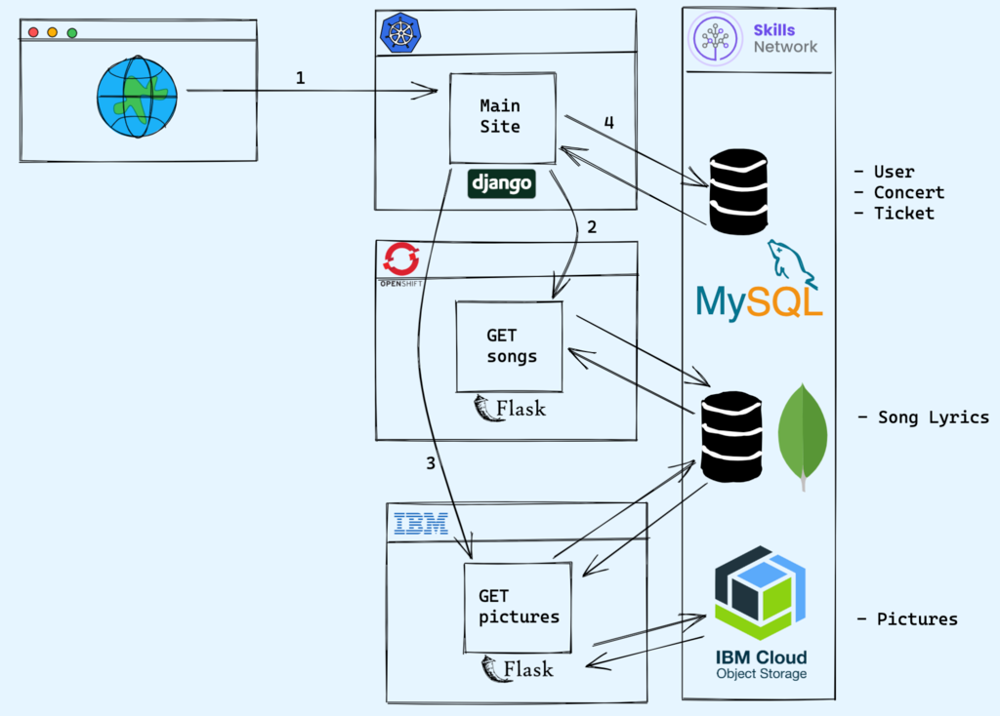

# 🎸 BandConnect

## **BandConnect** is a full-stack capstone project that brings fans closer to their favorite music band. The platform allows users to view concert pictures, read song lyrics, check upcoming events, register for concerts, and manage their reservations — all in one seamless experience.

## 🧱 System Architecture



This diagram shows the interaction between the user, Django main site, Flask microservices, and the databases:

- **Django** runs on IBM Kubernetes Service and interacts with:
  - A Flask microservice on IBM Code Engine (pictures)
  - A Flask + MongoDB microservice on RedHat OpenShift (songs)
- Data is stored in **MySQL**, **MongoDB**, and **IBM Cloud Object Storage**.

---

---

## 🚀 Features

### 🧑‍🎤 Anonymous Users

- View popular song lyrics
- Browse pictures from past concerts
- See upcoming events

### 🔐 Registered Users

- Create an account and sign in
- Register for upcoming concerts
- View and manage their registrations

### ⚙️ Admin Users

- Modify concert details (e.g., update concert dates)

---

## 🛠️ Technologies Used

### 🔹 Microservices

- **Flask** for building REST APIs

  - **Get Pictures Service**
    This microservice allows users to view, add, update, and delete images from past concerts. It provides a RESTful API for managing concert pictures, making it easy to integrate with other applications or frontends.

    **Endpoints:**

    | Action | Method | Return Code    | Body                               | URL Endpoint    |
    | ------ | ------ | -------------- | ---------------------------------- | --------------- |
    | List   | GET    | 200 OK         | Array of picture URLs `[{...}]`    | `/picture`      |
    | Create | POST   | 201 CREATED    | A picture resource as JSON `{...}` | `/picture`      |
    | Read   | GET    | 200 OK         | A picture as JSON `{...}`          | `/picture/{id}` |
    | Update | PUT    | 200 OK         | A picture as JSON `{...}`          | `/picture/{id}` |
    | Delete | DELETE | 204 NO CONTENT | `""`                               | `/picture/{id}` |

  - **Get Songs Service**
    This microservice manages the lyrics of the band's most popular songs using a MongoDB database. It supports full CRUD operations and provides additional endpoints for health checks and counting the number of songs. The PyMongo library is used for seamless interaction with MongoDB.

    **Endpoints:**

    | Action | Method | Return Code    | Body                            | URL Endpoint |
    | ------ | ------ | -------------- | ------------------------------- | ------------ |
    | List   | GET    | 200 OK         | Array of songs `[{...}]`        | /song        |
    | Create | POST   | 201 CREATED    | A song resource as JSON `{...}` | /song        |
    | Read   | GET    | 200 OK         | A song as JSON `{...}`          | /song/{id}   |
    | Update | PUT    | 200 OK         | A song as JSON `{...}`          | /song/{id}   |
    | Delete | DELETE | 204 NO CONTENT | `""`                            | /song/{id}   |
    | Health | GET    | 200 OK         | `""`                            | /health      |
    | Count  | GET    | 200 OK         | `""`                            | /count       |

### 🔹 Database

- **MongoDB** for storing and retrieving song lyrics
- **SQLite** for managing Django application data

### 🔹 Main Application

- **Django** for core web application (MVC structure)
- **Django Templates** for rendering views with Bootstrap styling
- **Django Auth** for user registration, login, and role-based access control
- **SQLite** database for storing concert and user registration data
- **Requests** library for consuming Flask microservices APIs

**Core Features:**

| Feature            | URL Pattern       | Description                                     | Access Level  |
| ------------------ | ----------------- | ----------------------------------------------- | ------------- |
| Home Page          | `/`               | Band introduction and featured content          | Public        |
| Songs List         | `/songs/`         | Display all song titles from Songs microservice | Public        |
| Photo Gallery      | `/photos/`        | Concert pictures from Pictures microservice     | Public        |
| User Login         | `/login/`         | Authentication for registered users             | Public        |
| User Signup        | `/signup/`        | New user registration                           | Public        |
| Concerts List      | `/concerts/`      | View upcoming concerts and registrations        | Authenticated |
| Concert Details    | `/concerts/<id>/` | Individual concert information                  | Authenticated |
| Concert Management | `/admin/`         | CRUD operations for concerts                    | Admin Only    |

**Django App Structure:**

- **concert/models.py** - Concert and UserRegistration data models
- **concert/views.py** - Business logic and microservice integration
- **concert/forms.py** - User input forms for registration and concert management
- **templates/** - HTML templates with responsive Bootstrap design
- **static/** - CSS, JavaScript, and image assets

**Microservice Integration:**

- Consumes Songs API at `/song` endpoint for lyrics display
- Fetches concert photos from Pictures API at `/picture` endpoint
- Handles API errors gracefully with fallback content

**Authentication & Authorization:**

- Django's built-in User model for account management
- Session-based authentication
- Role-based access (Admin users can manage concerts)
- User registration tracking for concert attendance

### 🔹 Deployment

- **IBM Code Engine** for deploying the Pictures microservice
- **RedHat OpenShift** for deploying the Songs microservice and MongoDB
- **IBM Kubernetes Service (IKS)** for deploying the main Django application

---

## 📸 Screenshots

> Screenshots demonstrating features and architecture to be added during implementation

---

## 🧭 Project Structure

```
bandconnect/
├── pictures-service/          # Flask microservice for event images
├── songs-service/             # Flask + MongoDB microservice for song lyrics
├── main-app/                  # Django web application
└── README.md
```

---

## 🧪 Health Checks

Each microservice exposes a `/health` endpoint to monitor its status.

---

## 📦 Setup Instructions

> Setup and deployment instructions will be updated here as development progresses.

---

## 🌐 Live Demo

> [Coming Soon – to be updated after deployment]

---

## 🤝 Contributing

Contributions are welcome. Please fork the repository and open a pull request.

---
