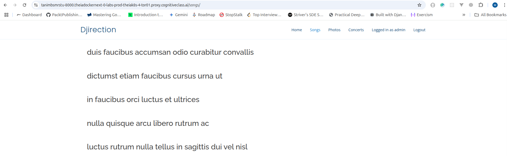

# 🎸 BandConnect

**BandConnect** is a full-stack capstone project that brings fans closer to their favorite music band. The platform allows users to view concert pictures, read song lyrics, check upcoming events, register for concerts, and manage their reservations — all in one seamless experience.

## 📋 Table of Contents

- [🎸 BandConnect](#-bandconnect)
- [📋 Table of Contents](#-table-of-contents)
- [🧱 System Architecture](#-system-architecture)
- [🚀 Features](#-features)
  - [🧑‍🎤 Anonymous Users](#-anonymous-users)
  - [🔐 Registered Users](#-registered-users)
  - [⚙️ Admin Users](#️-admin-users)
- [🛠️ Technologies Used](#️-technologies-used)
  - [🔹 Microservices](#-microservices)
  - [🔹 Database](#-database)
  - [🔹 Main Application](#-main-application)
  - [🔹 Deployment](#-deployment)
- [📸 Screenshots](#-screenshots)
  - [🏠 Home Page](#-home-page)
  - [🎵 Songs Gallery](#-songs-gallery)
  - [📷 Photo Gallery](#-photo-gallery)
  - [🎫 Concert Registration](#-concert-registration)
  - [👤 User Authentication](#-user-authentication)
  - [⚙️ Admin Panel](#️-admin-panel)
- [🧭 Project Structure](#-project-structure)
- [🧪 Health Checks](#-health-checks)
- [🚀 Deployment Instructions](#-deployment-instructions)
  - [📱 Pictures Microservice - IBM Code Engine](#-pictures-microservice---ibm-code-engine)
  - [🎵 Songs Microservice - RedHat OpenShift](#-songs-microservice---redhat-openshift)
  - [🌐 Django Application - IBM Kubernetes Service](#-django-application---ibm-kubernetes-service)
- [🌐 Live Demo](#-live-demo)
- [🔐 Default Admin Credentials](#-default-admin-credentials)
- [🙏 Acknowledgments](#-acknowledgments)

---

## 🧱 System Architecture


This diagram shows the interaction between the user, Django main site, Flask microservices, and the databases:

- **Django** runs on IBM Kubernetes Service and interacts with:
  - A Flask microservice on IBM Code Engine (pictures)
  - A Flask + MongoDB microservice on RedHat OpenShift (songs)
- Data is stored in **MySQL**, **MongoDB**, and **IBM Cloud Object Storage**.

---

## 🚀 Features

### 🧑‍🎤 Anonymous Users

- View popular song lyrics
- Browse pictures from past concerts
- See upcoming events

### 🔐 Registered Users

- Create an account and sign in
- Register for upcoming concerts
- View and manage their registrations

### ⚙️ Admin Users

- Modify concert details (e.g., update concert dates)

---

## 🛠️ Technologies Used

### 🔹 Microservices

- **Flask** for building REST APIs

  - **Get Pictures Service**
    This microservice allows users to view, add, update, and delete images from past concerts. It provides a RESTful API for managing concert pictures, making it easy to integrate with other applications or frontends.

    **Endpoints:**

    | Action | Method | Return Code    | Body                               | URL Endpoint    |
    | ------ | ------ | -------------- | ---------------------------------- | --------------- |
    | List   | GET    | 200 OK         | Array of picture URLs `[{...}]`    | `/picture`      |
    | Create | POST   | 201 CREATED    | A picture resource as JSON `{...}` | `/picture`      |
    | Read   | GET    | 200 OK         | A picture as JSON `{...}`          | `/picture/{id}` |
    | Update | PUT    | 200 OK         | A picture as JSON `{...}`          | `/picture/{id}` |
    | Delete | DELETE | 204 NO CONTENT | `""`                               | `/picture/{id}` |

  - **Get Songs Service**
    This microservice manages the lyrics of the band's most popular songs using a MongoDB database. It supports full CRUD operations and provides additional endpoints for health checks and counting the number of songs. The PyMongo library is used for seamless interaction with MongoDB.

    **Endpoints:**

    | Action | Method | Return Code    | Body                            | URL Endpoint |
    | ------ | ------ | -------------- | ------------------------------- | ------------ |
    | List   | GET    | 200 OK         | Array of songs `[{...}]`        | /song        |
    | Create | POST   | 201 CREATED    | A song resource as JSON `{...}` | /song        |
    | Read   | GET    | 200 OK         | A song as JSON `{...}`          | /song/{id}   |
    | Update | PUT    | 200 OK         | A song as JSON `{...}`          | /song/{id}   |
    | Delete | DELETE | 204 NO CONTENT | `""`                            | /song/{id}   |
    | Health | GET    | 200 OK         | `""`                            | /health      |
    | Count  | GET    | 200 OK         | `""`                            | /count       |

### 🔹 Database

- **MongoDB** for storing and retrieving song lyrics
- **SQLite** for managing Django application data

### 🔹 Main Application

- **Django** for core web application (MVC structure)
- **Django Templates** for rendering views with Bootstrap styling
- **Django Auth** for user registration, login, and role-based access control
- **SQLite** database for storing concert and user registration data
- **Requests** library for consuming Flask microservices APIs

**Core Features:**

| Feature            | URL Pattern       | Description                                     | Access Level  |
| ------------------ | ----------------- | ----------------------------------------------- | ------------- |
| Home Page          | `/`               | Band introduction and featured content          | Public        |
| Songs List         | `/songs/`         | Display all song titles from Songs microservice | Public        |
| Photo Gallery      | `/photos/`        | Concert pictures from Pictures microservice     | Public        |
| User Login         | `/login/`         | Authentication for registered users             | Public        |
| User Signup        | `/signup/`        | New user registration                           | Public        |
| Concerts List      | `/concerts/`      | View upcoming concerts and registrations        | Authenticated |
| Concert Details    | `/concerts/<id>/` | Individual concert information                  | Authenticated |
| Concert Management | `/admin/`         | CRUD operations for concerts                    | Admin Only    |

**Django App Structure:**

- **concert/models.py** - Concert and UserRegistration data models
- **concert/views.py** - Business logic and microservice integration
- **concert/forms.py** - User input forms for registration and concert management
- **templates/** - HTML templates with responsive Bootstrap design
- **static/** - CSS, JavaScript, and image assets

**Microservice Integration:**

- Consumes Songs API at `/song` endpoint for lyrics display
- Fetches concert photos from Pictures API at `/picture` endpoint
- Handles API errors gracefully with fallback content

**Authentication & Authorization:**

- Django's built-in User model for account management
- Session-based authentication
- Role-based access (Admin users can manage concerts)
- User registration tracking for concert attendance

### 🔹 Deployment

- **IBM Code Engine** for deploying the Pictures microservice
- **RedHat OpenShift** for deploying the Songs microservice and MongoDB
- **IBM Kubernetes Service (IKS)** for deploying the main Django application

---

## 📸 Screenshots

### 🏠 Home Page


_Welcome page with band introduction and navigation to main features_

### 🎵 Songs Gallery



_Browse song lyrics from the Flask microservice on OpenShift_

### 📷 Photo Gallery


_Concert pictures from the Flask microservice on Code Engine_

### 🎫 Concert Registration


_User registration for upcoming concerts_

### 👤 User Authentication


_User login and signup functionality_

### ⚙️ Admin Panel


_Django admin interface for concert management_

---

## 🧭 Project Structure

```
bandconnect/
├── get_picture_service/       # Flask microservice for event images
│   ├── app.py                # Main Flask application
│   ├── Dockerfile            # Container configuration
│   ├── requirements.txt      # Python dependencies
│   └── bin/setup.sh         # Environment setup script
├── get_songs_service/         # Flask + MongoDB microservice for song lyrics
│   ├── app.py                # Main Flask application
│   ├── Dockerfile            # Container configuration
│   ├── requirements.txt      # Python dependencies
│   └── bin/setup.sh         # Environment setup script
├── main_django_app/           # Django web application
│   ├── bandconnect/          # Django project settings
│   ├── concert/              # Main Django app
│   ├── templates/            # HTML templates
│   ├── static/               # CSS, JS, images
│   ├── Dockerfile            # Container configuration
│   ├── requirements.txt      # Python dependencies
│   ├── deployment.yml        # Kubernetes deployment config
│   └── bin/setup.sh         # Environment setup script
├── screenshots/               # Application screenshots
└── README.md
```

---

## 🧪 Health Checks

Each microservice exposes a `/health` endpoint to monitor its status.

---

## 🚀 Deployment Instructions

### 📱 Pictures Microservice - IBM Code Engine

Deploy the pictures microservice to IBM Code Engine using the source-to-image method:

| Step | Command                   | Description                                                                                                                        |
| ---- | ------------------------- | ---------------------------------------------------------------------------------------------------------------------------------- |
| 1    | Start Code Engine project | Initialize your Code Engine environment                                                                                            |
| 2    | Configure namespace       | Set up the container registry namespace                                                                                            |
| 3    | Build image               | `docker build -t us.icr.io/${SN_ICR_NAMESPACE}/pictures:1 .`                                                                       |
| 4    | Push to registry          | `docker push us.icr.io/$SN_ICR_NAMESPACE/pictures:1`                                                                               |
| 5    | Deploy application        | `ibmcloud ce app create --name pictures --image us.icr.io/${SN_ICR_NAMESPACE}/pictures:1 --registry-secret icr-secret --port 3000` |

**Setup Script Usage:**

```bash
# Navigate to pictures service directory
cd get_picture_service/

# Run setup script to configure environment
./bin/setup.sh

# Follow the deployment steps above
```

### 🎵 Songs Microservice - RedHat OpenShift

Deploy the songs microservice to RedHat OpenShift with MongoDB:

**1. Install MongoDB on OpenShift:**

```yaml
apiVersion: image.openshift.io/v1
kind: ImageStream
metadata:
  name: mongo
spec:
  lookupPolicy:
    local: false
  tags:
    - name: latest
      from:
        kind: DockerImage
        name: docker.io/library/mongo:latest
```

**2. Deploy the Songs Service:**

```bash
# Navigate to songs service directory
cd get_songs_service/

# Run setup script to configure environment
./bin/setup.sh

# Get project details
oc get project

# Deploy application with source-to-image
oc new-app https://github.com/${GITHUB_ACCOUNT}/Back-End-Development-Songs \
  --strategy=source \
  --name=songs \
  --env MONGODB_SERVICE=mongo.{OPENSHIFT_PROJECT}.svc.cluster.local

# Monitor build logs
oc logs -f buildconfig/songs

# Expose to internet
oc expose service/songs
oc get route songs
```

### 🌐 Django Application - IBM Kubernetes Service

Deploy the Django application on IBM Kubernetes Service (IKS):

#### **Prerequisites**

- IBM Cloud CLI installed and configured
- Docker installed
- kubectl configured for your IKS cluster
- Access to IBM Container Registry (ICR)

#### **Step-by-Step Deployment**

**1. Environment Setup**

```bash
# Navigate to Django app directory
cd main_django_app/

# Set up the environment using the setup script
./bin/setup.sh
```

**2. Database Migrations**

```bash
# Create and apply database migrations
python3 manage.py makemigrations
python3 manage.py migrate

# Create superuser (optional)
python3 manage.py createsuperuser
```

**3. Configure Microservice URLs**
Update the microservice URLs in your Django views to point to the deployed services:

- Pictures Service: `https://pictures.1wgl1isji4om.us-south.codeengine.appdomain.cloud`
- Songs Service: `http://songs-sn-labs-tanimbsmrstu.labs-prod-openshift-san-a45631dc5778dc6371c67d206ba9ae5c-0000.us-east.containers.appdomain.cloud`

**4. Build Docker Image**

```bash
# Build the Docker image
docker build -t us.icr.io/${SN_ICR_NAMESPACE}/djangoserver:1 .

# Push to IBM Container Registry
docker push us.icr.io/${SN_ICR_NAMESPACE}/djangoserver:1
```

**5. Configure Kubernetes Deployment**
Ensure your `deployment.yml` file is properly configured

**6. Deploy to Kubernetes**

```bash
# Apply the deployment configuration
kubectl apply -f ./deployment.yml

# Verify deployment status
kubectl get deployments
kubectl get pods
kubectl get services
```

**7. Access the Application**

```bash
# Get the pod name
kubectl get pods

# Port forward to access the application locally
kubectl port-forward pod/{pod_name} 8000:8000

# Application will be available at: http://localhost:8000
```

**8. Expose Service (Optional)**
To make the service accessible from outside the cluster:

```bash
# Create a LoadBalancer service
kubectl expose deployment djangoserver --type=LoadBalancer --port=8000

# Get external IP
kubectl get services djangoserver
```

#### **Verification Steps**

1. **Health Check**: Verify the application is running

   ```bash
   curl http://localhost:8000/
   ```

2. **Service Integration**: Test microservice connectivity

   ```bash
   curl http://localhost:8000/songs/
   curl http://localhost:8000/photos/
   ```

3. **Admin Panel**: Access Django admin
   ```bash
   # Navigate to: http://localhost:8000/admin/
   # Use your created superuser credentials
   ```

#### **Troubleshooting**

| Issue                     | Solution                                           |
| ------------------------- | -------------------------------------------------- |
| Pod not starting          | Check logs: `kubectl logs deployment/djangoserver` |
| Image pull errors         | Verify ICR credentials and image path              |
| Database errors           | Ensure migrations are applied in the container     |
| Microservice connectivity | Verify service URLs and network policies           |

---

## 🌐 Live Demo

- **Main Django Application**: http://localhost:8000 (via port-forward)
- **Pictures Service**: https://pictures.1wgl1isji4om.us-south.codeengine.appdomain.cloud
- **Songs Service**: http://songs-sn-labs-tanimbsmrstu.labs-prod-openshift-san-a45631dc5778dc6371c67d206ba9ae5c-0000.us-east.containers.appdomain.cloud

## 🔐 Default Admin Credentials

- **Username**: admin
- **Password**: admin

---

## 🙏 Acknowledgments

- IBM Cloud for providing the deployment infrastructure
- RedHat OpenShift for container orchestration
- Django and Flask communities for excellent documentation
- Bootstrap for responsive UI components
